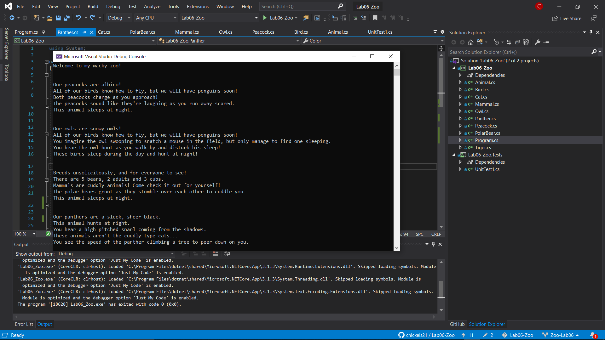

# Lab06-Zoo

A virtual zoo to demostrate use of class inheritence.

## Summary

This is a console application written is C# using the .NET Core framework.  Utilizing OOP principles to define abstract classes with sub classes and three levels of inheritence, the console app prints out all of the different animal's properties and method results.  Below is a diagram defining the relationships of all of the subsequent sub classes and their relations to each other:

## OOP Principles

### Inheritence

As shown above there are three layers of in heritence, starting with animal, down to bird or mammal, and then the bird branches into either peacocks or owls, and our mammal branches off either to a polar bear, or into an abstract cat class that then branches into either a tiger or panther.

### Abstraction

Properties and\or methods are declared in a parent class but remain undefined until a sub class overrides and instantiates that property or variable.  The sound and action methods in my animal class are both abstract and are not defined until the specific type concrete class defines what those methods do.

### Polymorphism

An example of this in my code is the different actions that each animal exhibits.  Also, in cat, each animal has a different color description.  So polymorphism is the idea that a trait is defined in a parent class and defined differently in sub classes.

### Encapsulation

This is the idea of having public properties, classes, methods, etc. available to other sub classes and surrounding name spaces.  However, private and protected are two other options.  Private classes and so on cannot be used by sub classes and I utilize private properties when defining the colors for each type of animal \(even though they don't have any sub classes\).